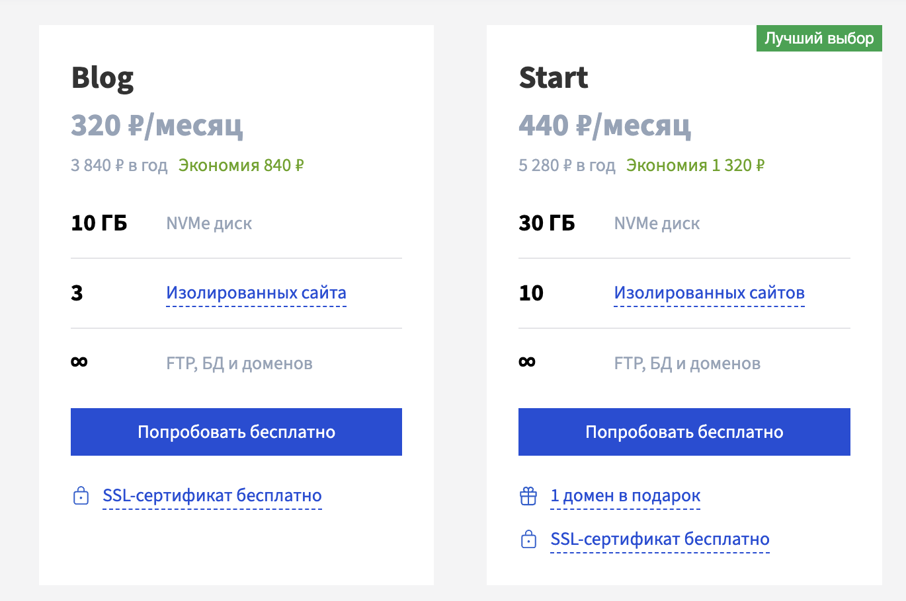
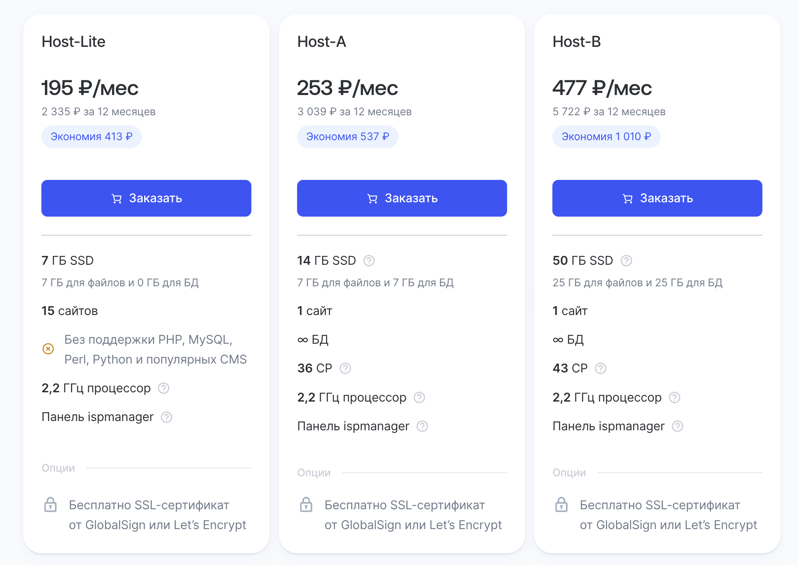
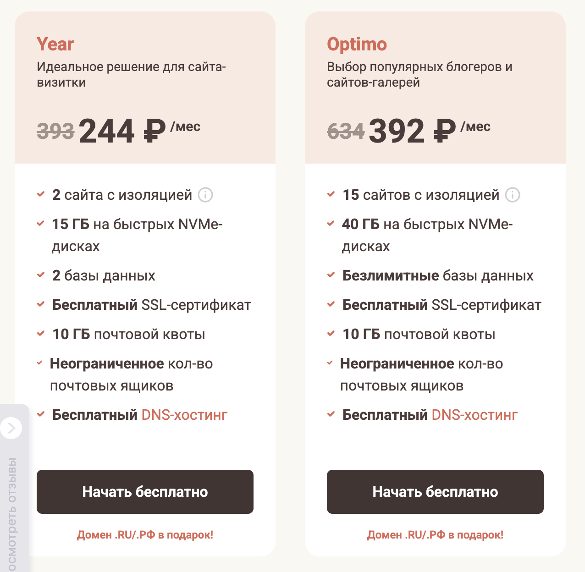
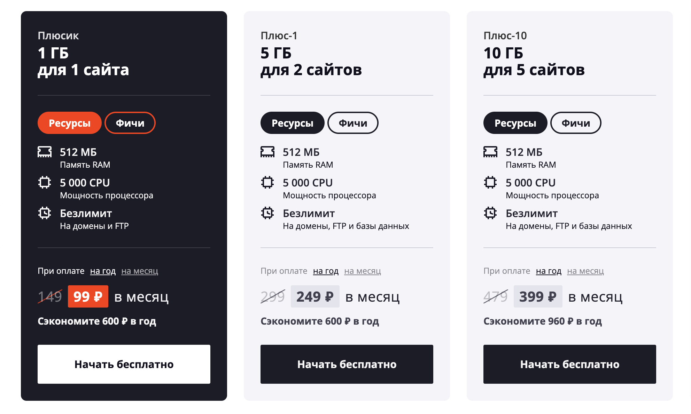
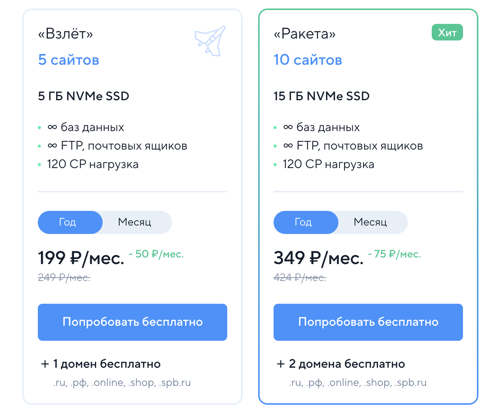

# Руководство

Как мы работаем и что нужно знать

## Этапы работы

1. **Обсуждаем задачу** (созвон/переписка, обсуждаем цели и примеры).
2. **Договор и предоплата (50%)**.
3. **Создаём сайт** (дизайн → верстка → адаптация → тесты) ⏳ 1–2 недели.
4. **Сдача проекта и финальный расчёт** + помощь с размещением на хостинге.

## Чтобы сайт заработал

Нужно приобрести домен и хостинг (оплачивается отдельно).

При необходимости поможем выбрать тариф и настроим хостинг. <3

📌 Для удобства подготовили таблицу хостингов с ценами (ниже)

## Таблица хостингов для сайта

_Цены для примерного понимания (от 17 июля 2025 г)_

| Провайдер  | Цена на годовой абонемент | SSL             | Домен                  |
| ---------- | ------------------------- | --------------- | ---------------------- |
| Beget      | от 3 840 ₽                | во всех тарифах | от тарифа Start        |
| REG.RU     | от 2 335 ₽                | во всех тарифах | приобретается отдельно |
| Timeweb    | от 2 929 ₽                | во всех тарифах | во всех тарифах        |
| Sprinthost | от 2 988 ₽                | во всех тарифах | от тарифа Плюс-1       |
| SpaceWeb   | от 2 664 ₽                | во всех тарифах | приобретается отдельно |

[Тарифы Beget](https://beget.com/ru/hosting/virtual#virtual-plans-list)

[Тарифы REG.RU](https://www.reg.ru/hosting/?tariff=econom)

[Тарифы Timeweb](https://timeweb.com/ru/services/hosting/)

[Тарифы Sprinthost](https://sprinthost.ru/)

[Тарифы Sweb](https://sweb.ru/)

## Хотите форму для заявок на сайт?

Чтобы всё было по закону:

- SSL (часто идет бесплатно в тарифах хостинг провайдеров);
- Уведомить Роскомнадзор [форма](https://pd.rkn.gov.ru/operators-registry/notification/form/);
- На сайте: политика конфиденциальности + чек-бокс в форме.

📄 [Федеральный закон №152-ФЗ](https://letters.kremlin.ru/info-service/acts/9)
