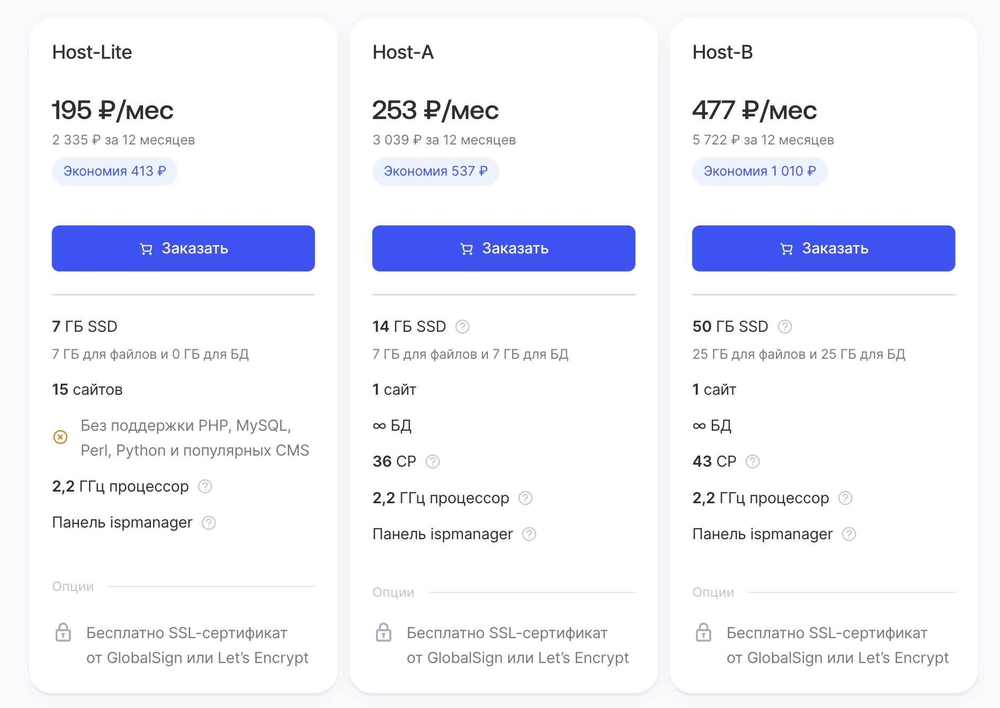
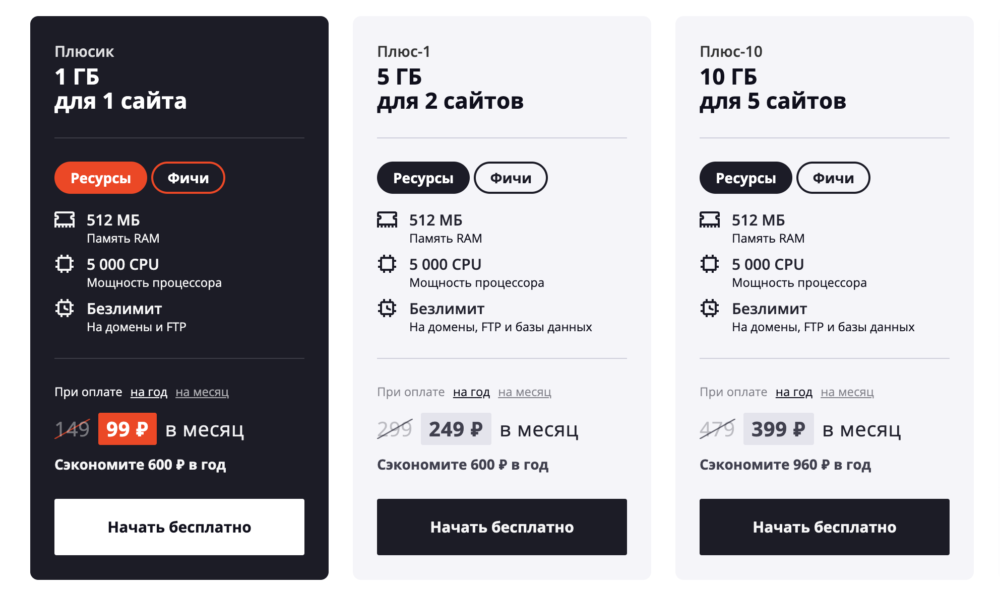
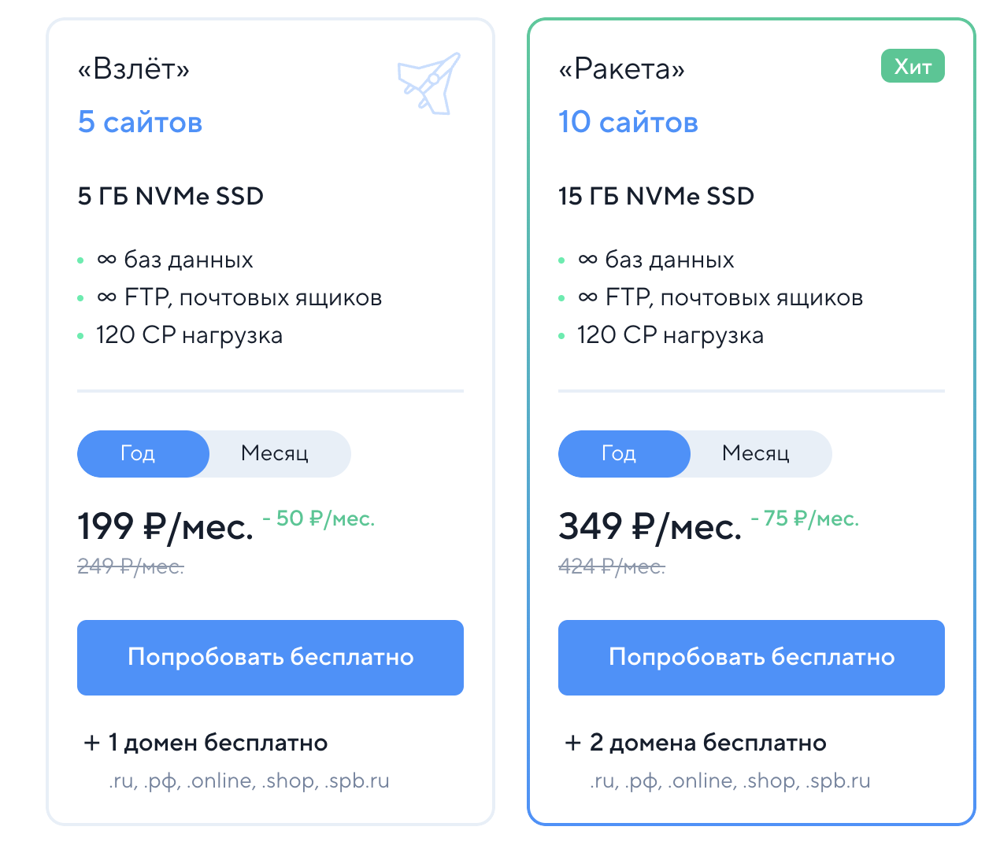

## Таблица хостингов для сайта

_Цены для примерного понимания (от 17 июля 2025 г)_

| Провайдер | Цена на годовой абонемент | SSL | Домен |
| --- | --- | --- | --- |
| Beget | от 3 840 ₽ | во всех тарифах | от тарифа Start | 
| REG.RU | от 2 335 ₽ | во всех тарифах | приобретается отдельно | 
| Timeweb | от 2 929 ₽ | во всех тарифах |  во всех тарифах | 
| Sprinthost | от 2 988 ₽ | во всех тарифах | от тарифа Плюс-1 | 
| SpaceWeb | от 2 664 ₽ | во всех тарифах | приобретается отдельно | 

[Тарифы Beget](https://beget.com/ru/hosting/virtual#virtual-plans-list)

[Тарифы REG.RU](https://www.reg.ru/hosting/?tariff=econom)

[Тарифы Timeweb](https://timeweb.com/ru/services/hosting/)

[Тарифы Sprinthost](https://sprinthost.ru/)

[Тарифы Sweb](https://sweb.ru/)
